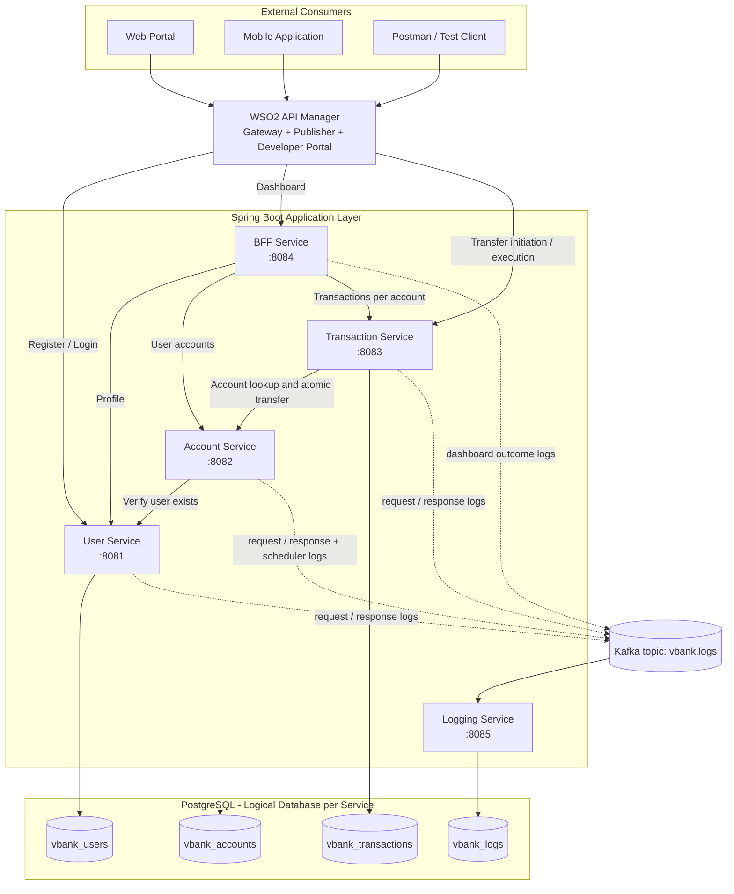
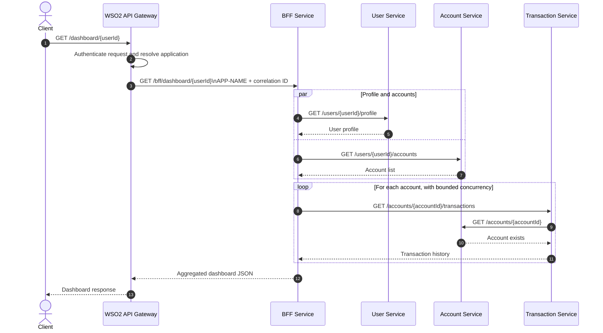
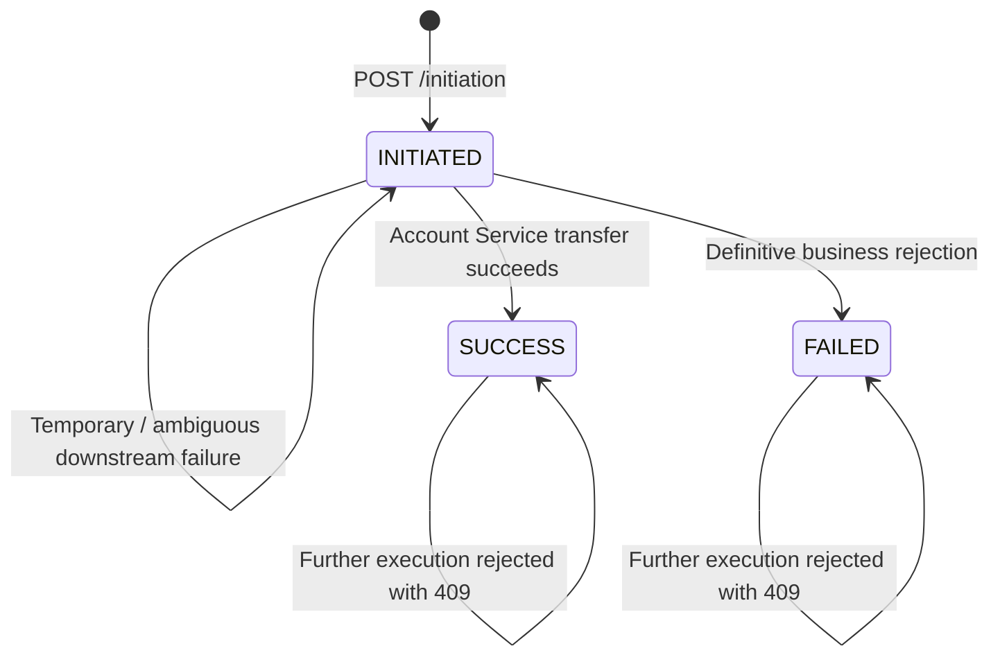
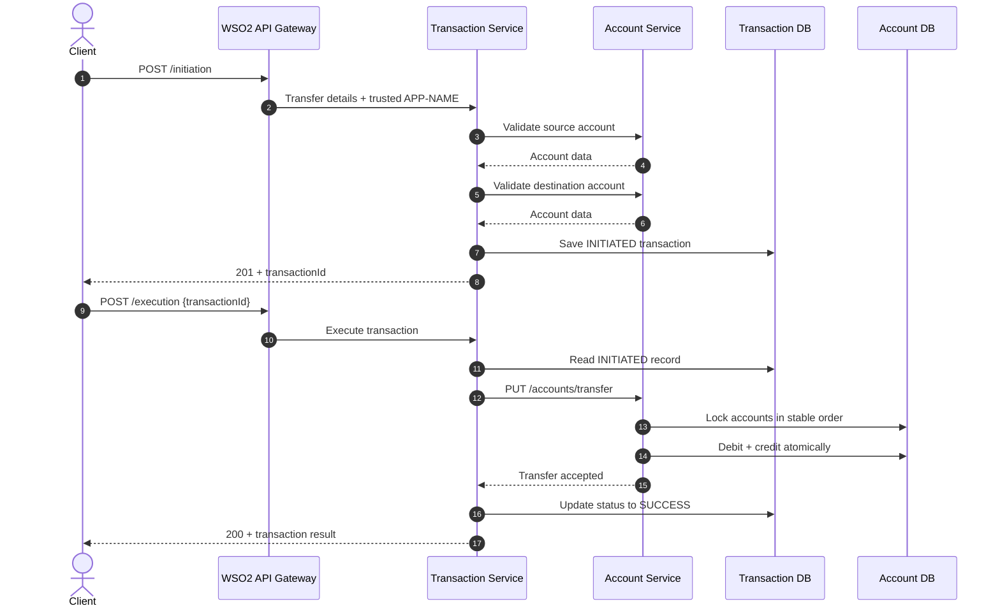
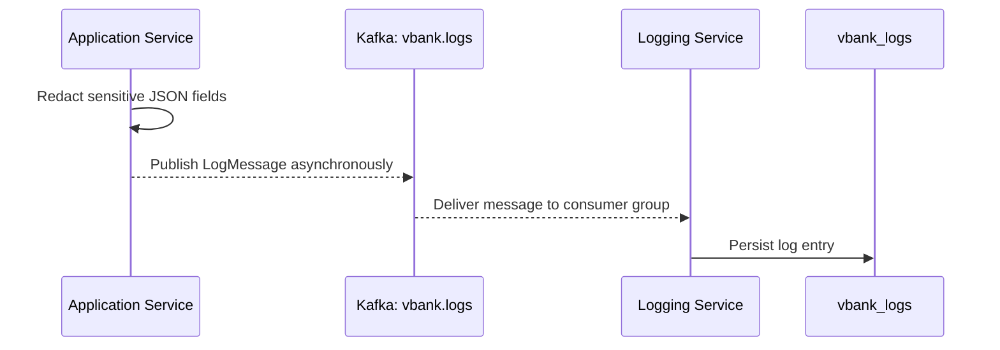

# Virtual Bank System

A simplified virtual banking platform built as a set of Java 21 and Spring Boot microservices. The project demonstrates domain-oriented service decomposition, a Backend for Frontend (BFF), WSO2 API Manager as the external gateway, PostgreSQL database ownership per service, synchronous REST communication, Kafka-based centralized logging, and scheduled account maintenance.

> This README documents the implementation currently present in this repository. It also identifies the prototype limitations that should be discussed honestly during the project defense.

## Team Contributions

The project was developed collaboratively, with responsibilities divided across the main services and infrastructure components.

### Aly Walid — Member 1

Responsible for the implementation and integration of:

- User Service
- Account Service
- BFF Service
- WSO2 API Manager configuration and API Gateway integration

### Eslam Fawzy — Member 2

Responsible for the implementation and integration of:

- Transaction Service
- Logging Service
- Apache Kafka integration
- GitHub Actions continuous integration workflow

Both team members collaborated on system integration, API testing, debugging, architectural decisions, docker compose environment, and final project documentation.

---

## Table of Contents

- [Project Objectives](#project-objectives)
- [System Architecture](#system-architecture)
- [Architectural Patterns](#architectural-patterns)
- [Services and Responsibilities](#services-and-responsibilities)
- [Main System Flows](#main-system-flows)
- [WSO2 API Gateway](#wso2-api-gateway)
- [Backend API Reference](#backend-api-reference)
- [Cross-Cutting Design](#cross-cutting-design)
- [Technology Stack](#technology-stack)
- [Repository Structure](#repository-structure)
- [Running the Project](#running-the-project)
- [Testing and CI](#testing-and-ci)
- [Current Scope and Limitations](#current-scope-and-limitations)
- [Project Defense](#project-defense)

---

## Project Objectives

The project was designed to demonstrate how a banking-oriented application can be structured as a distributed system rather than as one large application. Its main objectives are to:

- separate user, account, transaction, dashboard, and logging responsibilities;
- expose external operations through a managed API gateway;
- aggregate frontend-specific data through a BFF;
- preserve service-level database ownership;
- perform account transfers atomically inside the Account Service;
- record transaction state independently from account balances;
- publish operational logs asynchronously through Kafka;
- propagate application identity and correlation information across service calls;
- automate account inactivity processing with a scheduled job.

The system is an educational prototype. It demonstrates architectural concepts and trade-offs rather than attempting to reproduce the complete regulatory, security, and operational requirements of a production bank.

---

## System Architecture



### Boundary of Responsibility

The intended external boundary is WSO2 API Manager. Clients should not depend directly on internal service URLs. Internally, services communicate through REST APIs and Kafka; they do not query another service's tables.

A single PostgreSQL container hosts four logical databases for local development. This keeps deployment simple while preserving database ownership at the service level.

---

## Architectural Patterns

### 1. Microservices Architecture

The banking domains are implemented as separate Spring Boot applications. Each service has its own controllers, business logic, configuration, persistence model, exception handling, Dockerfile, and Maven build.

This separation provides:

- clear ownership of business capabilities;
- independent data models;
- reduced coupling between domains;
- the ability to change or scale a service independently;
- explicit network contracts between services.

The trade-off is increased distributed-system complexity: network failures, partial failures, data consistency, tracing, configuration, and deployment must all be considered.

### 2. API Gateway Pattern

WSO2 API Manager is the external entry point. It packages the public APIs, applies gateway security, routes requests, identifies the calling application, and can enforce throttling and monitoring policies.

The gateway prevents clients from needing to know the internal topology. The current WSO2 exports also implement a custom policy that replaces any client-supplied `APP-NAME` header with a trusted value derived from the authenticated WSO2 application.

### 3. Backend for Frontend Pattern

The BFF exposes one dashboard operation optimized for the frontend:

```http
GET /bff/dashboard/{userId}
```

Instead of forcing the frontend to call three services and combine their responses, the BFF:

1. requests the user profile;
2. requests the user's accounts;
3. retrieves transactions for every account concurrently;
4. returns one frontend-oriented response.

This reduces client chattiness and moves orchestration and response composition to the backend.

### 4. Database-per-Service

Each persistent service owns a logical PostgreSQL database:

| Service | Database |
|---|---|
| User Service | `vbank_users` |
| Account Service | `vbank_accounts` |
| Transaction Service | `vbank_transactions` |
| Logging Service | `vbank_logs` |
| BFF Service | No database |

The Transaction Service never updates account tables directly. It calls the Account Service, which remains the owner of balances and account status.

### 5. Event-Driven Logging

HTTP request and response logs are published to the `vbank.logs` Kafka topic without making the business response wait for the Logging Service. The Logging Service consumes the messages and stores them in its own database.

This is asynchronous communication: a temporary logging failure does not intentionally block the banking operation.

### 6. Scheduled Processing

The Account Service runs an hourly scheduled job. It marks eligible accounts as inactive when both their most recent transaction and most recent reactivation are older than the configured inactivity threshold. `SYSTEM` accounts are excluded.

---

## Services and Responsibilities

| Component | Port | Main Responsibility | Persistence |
|---|---:|---|---|
| User Service | `8081` | Registration, credential validation, and user profiles | `vbank_users` |
| Account Service | `8082` | Account creation, retrieval, activation, balances, atomic transfers, inactivity scheduler | `vbank_accounts` |
| Transaction Service | `8083` | Transfer initiation, execution state, and transaction history | `vbank_transactions` |
| BFF Service | `8084` | Dashboard aggregation and downstream orchestration | None |
| Logging Service | `8085` | Kafka log consumption and persistence | `vbank_logs` |
| PostgreSQL | `5432` | Hosts four logical databases | Docker volume |
| Kafka | `9092` | Central asynchronous logging topic | Kafka storage |
| WSO2 API Manager | `9443`, `8243`, `8280` | API management and gateway | Docker volumes |

### User Service

Implemented capabilities:

- validates and normalizes usernames and email addresses;
- enforces case-insensitive uniqueness in both application logic and database constraints;
- hashes passwords using BCrypt;
- returns a generic invalid-credentials response for both unknown users and incorrect passwords;
- never returns the password hash;
- supports profile retrieval by UUID;
- validates `APP-NAME` and propagates `X-Correlation-ID`;
- redacts sensitive fields before publishing logs.

### Account Service

Implemented capabilities:

- verifies a user through the User Service before creating an account;
- supports public `SAVINGS` and `CHECKING` accounts;
- reserves the `SYSTEM` type for internal functionality;
- generates unique 10-digit account numbers using `SecureRandom`;
- stores monetary values as `BigDecimal` with two decimal places;
- performs debit and credit inside one database transaction;
- locks both accounts with `PESSIMISTIC_WRITE` in a stable UUID order to reduce race conditions and deadlock risk;
- rejects self-transfers, non-positive amounts, inactive accounts, insufficient funds, and balance overflow;
- updates `lastTransactionAt` for both accounts after a transfer;
- supports explicit reactivation of non-system accounts;
- runs the inactivity scheduler every hour by default.

### Transaction Service

Implemented capabilities:

- validates that sender and receiver account IDs exist before creating a transaction;
- creates a persisted `INITIATED` record before money movement;
- calls the Account Service to perform the actual atomic balance transfer;
- changes the transaction to `SUCCESS` after a successful account update;
- changes it to `FAILED` for definitive business rejections;
- keeps it `INITIATED` for temporary or ambiguous downstream failures so that a retry remains possible;
- rejects execution of transactions that are no longer `INITIATED`;
- returns transaction history where an account is either the sender or receiver, newest first.

### BFF Service

Implemented capabilities:

- uses Spring WebFlux and `WebClient`;
- requests profile and account data concurrently using `Mono.zip`;
- retrieves transactions for multiple accounts with configurable concurrency;
- preserves account ordering with `flatMapSequential`;
- forwards `APP-NAME` and `X-Correlation-ID` to downstream services;
- validates downstream response structure and identifiers;
- maps downstream errors into frontend-facing `404`, `502`, `503`, and `504` responses;
- converts “no accounts” and “no transactions” responses to empty lists where appropriate.

### Logging Service

Implemented capabilities:

- consumes `LogMessage` objects from `vbank.logs`;
- uses a dedicated Kafka consumer group;
- stores message body, message type, service name, HTTP metadata, correlation ID, and application name;
- uses Kafka error-handling deserializers for consumer input.

---

## Main System Flows

### Dashboard Aggregation Flow



### Transfer Lifecycle





### Centralized Logging Flow



---

## WSO2 API Gateway

The repository contains exported WSO2 API artifacts under `wso2/exports/` and a reusable policy under `wso2/policies/`.

### Exported APIs

| WSO2 API | API Context | Public Resource | Backend Endpoint |
|---|---|---|---|
| VBank Register API | `/register-api` | `POST /register` | `http://user-service:8081/users/register` |
| VBank Login API | `/login-api` | `POST /login` | `http://user-service:8081/users/login` |
| VBank Dashboard API | `/dashboard-api` | `GET /dashboard/{userId}` | `http://bff-service:8084/bff/dashboard/{userId}` |
| VBank Transactions API | `/transactions-api` | `POST /initiation` | `http://transaction-service:8083/transactions/transfer/initiation` |
| VBank Transactions API | `/transactions-api` | `POST /execution` | `http://transaction-service:8083/transactions/transfer/execution` |

### API Product

The four APIs are packaged in the published `vbank` API product:

- name: `vbank`;
- version: `1.0.0`;
- context: `/vbank`;
- public operations: `/register`, `/login`, `/dashboard/{userId}`, `/initiation`, and `/execution`.

The product is the preferred public contract because the custom application-identity policy is attached to its operations.

### Security and Application Identity

The exports advertise WSO2 OAuth2 and API-key security mechanisms. Operations use the WSO2 `Application & Application User` authorization type.

Two WSO2 applications must exist with these exact names:

| WSO2 Application | Injected Header |
|---|---|
| `vbank portal` | `APP-NAME: PORTAL` |
| `vbank mobile` | `APP-NAME: MOBILE` |

The custom `InjectVBankAppName` policy:

1. removes any `APP-NAME` supplied directly by the client;
2. reads the authenticated WSO2 application name;
3. injects `PORTAL` or `MOBILE` into the backend request;
4. rejects unsupported applications with `403 Forbidden`.

This prevents a client from impersonating a different application merely by changing a header.

### Throttling Status

WSO2 supports throttling, but the current exported APIs and product use the `Unlimited` policy. A bounded subscription or operation-level policy should be configured before describing the system as actively rate-limited.

### WSO2 Import Notes

See [`wso2/README.md`](wso2/README.md) for the artifact inventory and recommended import sequence.

---

## Backend API Reference

These are internal backend routes. External clients should normally use the WSO2 API product.

### User Service

| Method | Path | Success | Description |
|---|---|---:|---|
| `POST` | `/users/register` | `201` | Register a new user |
| `POST` | `/users/login` | `200` | Validate username and password |
| `GET` | `/users/{userId}/profile` | `200` | Retrieve user profile |

### Account Service

| Method | Path | Success | Description |
|---|---|---:|---|
| `POST` | `/accounts` | `201` | Create a savings or checking account |
| `GET` | `/accounts/{accountId}` | `200` | Retrieve account details |
| `GET` | `/users/{userId}/accounts` | `200` | Retrieve all accounts belonging to a user |
| `PUT` | `/accounts/transfer` | `200` | Atomically transfer money between accounts |
| `PUT` | `/accounts/{accountId}/activate` | `200` | Reactivate an inactive non-system account |

### Transaction Service

| Method | Path | Success | Description |
|---|---|---:|---|
| `POST` | `/transactions/transfer/initiation` | `201` | Create an `INITIATED` transfer record |
| `POST` | `/transactions/transfer/execution` | `200` | Execute a previously initiated transfer |
| `GET` | `/accounts/{accountId}/transactions` | `200` | Return sent and received transactions |

### BFF Service

| Method | Path | Success | Description |
|---|---|---:|---|
| `GET` | `/bff/dashboard/{userId}` | `200` | Aggregate profile, accounts, and account transactions |

### Required Internal Headers

The servlet-based business services validate:

```http
APP-NAME: PORTAL | MOBILE
X-Correlation-ID: <UUID>
```

`X-Correlation-ID` is generated when missing or invalid. `APP-NAME` is expected to be injected by WSO2 in the intended request path.

---

## Cross-Cutting Design

### Validation and Error Responses

The services use Jakarta Bean Validation and centralized exception handlers. Errors follow a consistent structure similar to:

```json
{
  "timestamp": "2026-07-29T12:00:00Z",
  "status": 400,
  "error": "Bad Request",
  "message": "Amount must be greater than zero.",
  "path": "/accounts/transfer"
}
```

The BFF extends its error response with correlation and downstream-service information.

### Correlation IDs

`X-Correlation-ID` connects logs and downstream calls belonging to the same request. The services return it in the response and include it in Kafka log messages.

### Sensitive-Data Redaction

Before request or response bodies are published to Kafka, the logging filters recursively redact fields such as:

- passwords and password hashes;
- authorization values;
- access and refresh tokens;
- API keys and secrets.

Unparseable or non-JSON bodies are omitted rather than logged verbatim.

### Money and Concurrency

- Monetary values use `BigDecimal`, never floating-point types.
- Account balances use a fixed database precision and scale.
- The Account Service performs the debit and credit within one local transaction.
- Pessimistic row locks protect concurrent updates to the same accounts.
- Locks are acquired in a deterministic UUID order to reduce deadlock risk.

### Failure Handling Between Services

- definitive business failures during execution mark a transaction `FAILED`;
- service unavailability, gateway-like responses, or temporary conflicts leave it `INITIATED`;
- BFF requests fail fast when a required downstream service fails;
- Kafka publishing failures are logged locally and do not intentionally fail the banking response.

---

## Technology Stack

| Area | Technology |
|---|---|
| Language | Java 21 |
| Framework | Spring Boot 3.5.6 |
| MVC services | Spring Web |
| Reactive BFF | Spring WebFlux and Reactor |
| Persistence | Spring Data JPA and Hibernate |
| Database | PostgreSQL 16 |
| Messaging | Apache Kafka 4.0.0 |
| API management | WSO2 API Manager 4.7.0 |
| Validation | Jakarta Bean Validation |
| Security utility | Spring Security and BCrypt |
| Build | Maven Wrapper |
| Containers | Docker and Docker Compose |
| CI | GitHub Actions |
| API testing | Postman / WSO2 gateway clients |

---

## Repository Structure

```text
virtual-bank-system/
├── .github/workflows/ci-cd.yml
├── user-service/
├── account-service/
├── transaction-service/
├── bff-service/
├── logging-service/
├── infrastructure/
│   ├── docker-compose.yml
│   └── postgres
│       └── init.databases.sql
├── wso2/
│   ├── exports/
│   ├── policies/
│   └── README.md
├── docs/
│   ├── account-service.md
│   └── user-service.md  
├── postman/
└── README.md
```

Each service is a separate Maven project rather than a parent multi-module build.

---

## Running the Project

### Prerequisites

- Java 21;
- Docker with Docker Compose;
- Git;
- sufficient memory for PostgreSQL, Kafka, WSO2 API Manager, and five Spring Boot services.

### 1. Build the Service JARs

The current Dockerfiles copy an already-built JAR from each service's `target/` directory. Build the services before starting Compose:

```bash
for service in user-service account-service transaction-service bff-service logging-service; do
  (cd "$service" && chmod +x mvnw && ./mvnw clean package -DskipTests)
done
```

### 2. Start the Infrastructure and Services

```bash
docker compose -f infrastructure/docker-compose.yml up --build -d
```

Check status and logs:

```bash
docker compose -f infrastructure/docker-compose.yml ps
docker compose -f infrastructure/docker-compose.yml logs -f
```

Stop the environment:

```bash
docker compose -f infrastructure/docker-compose.yml down
```

To remove persisted local PostgreSQL and WSO2 data as well:

```bash
docker compose -f infrastructure/docker-compose.yml down -v
```


```

### Development Credentials

The Compose file currently contains development-only PostgreSQL credentials:

```text
username: vbank
password: vbank_password
```

They must be externalized and replaced for any non-local environment.

---

## Testing and CI

### Current Automated Tests

The repository currently contains Spring context-loading tests. User and Account Service tests use H2 in PostgreSQL compatibility mode. The test suite does not yet provide comprehensive unit, integration, concurrency, gateway, or end-to-end coverage.

### GitHub Actions

The CI workflow currently:

1. checks out the repository;
2. configures Java 21;
3. packages all five services with tests skipped;
4. starts Docker Compose;
5. waits for startup;
6. prints logs and lists running containers;
7. shuts the environment down.

This verifies packaging and basic container startup, but it is not yet a functional end-to-end test pipeline.

---

## Current Scope and Limitations

The following points are important to state clearly during the defense:

1. **The daily savings-interest scheduler is not implemented.** The `SYSTEM` account type is reserved, but there is no midnight interest process in the current code.
2. **Authentication is enforced primarily at the WSO2 boundary.** Backend services do not independently validate an OAuth access token; direct access to exposed development ports can bypass the gateway.
3. **The current WSO2 throttling policy is `Unlimited`.** The gateway is capable of throttling, but a bounded policy has not been configured in the exports.
4. **WSO2 applications are runtime configuration.** API and API-product exports are included, but the `vbank portal` and `vbank mobile` applications must be created in WSO2.
5. **Transaction re-execution protection is status-based.** It rejects ordinary repeated execution, but concurrent duplicate execution would require stronger transaction-row locking, optimistic versioning, or an idempotency-key design.
6. **Distributed money transfer is not a single cross-service transaction.** Account balance movement is atomic inside Account Service, while transaction status is stored separately. Temporary ambiguous failures are deliberately left `INITIATED`, but a production system would require reconciliation and stronger delivery guarantees.
7. **Automated testing is still limited.** Most current tests only verify Spring context startup, and CI skips test execution.
8. **Observability is foundational rather than complete.** Kafka logging and correlation IDs are implemented, but metrics, tracing, dashboards, retention, dead-letter handling, and alerting are outside the current scope.
9. **Configuration contains local-development defaults.** Credentials and some hostnames should be externalized more consistently for production deployment.

These limitations do not invalidate the architecture. They define the boundary between the implemented internship prototype and a production-grade banking platform.

---

## Project Defense

Use a short slide deck as the main presentation and keep this README open as supporting evidence. Do not present the project by scrolling through source files or reading the README line by line.

A strong defense should focus on:

- the problem and architectural objective;
- why each pattern was selected;
- the boundaries and responsibilities of every service;
- the transfer consistency model;
- the BFF aggregation flow;
- how WSO2 establishes the external security boundary and trusted application identity;
- how Kafka decouples logging from business operations;
- design trade-offs, failure handling, limitations, and future work.

